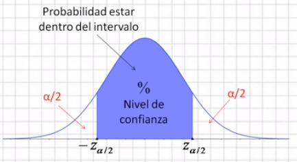

class: inverse, bottom, right

```{r, include=FALSE,echo=FALSE,results='hide'}
#install.packages("pagedown")
#pagedown::chrome_print("tercera_catedra.html",output="tercera_catedra.pdf")
```


```{r setup, include=FALSE, cache = FALSE}

library(dplyr)
require("knitr")
options(htmltools.dir.version = FALSE)
pacman::p_load(RefManageR)
 
```

```{r eval=FALSE, echo=FALSE}
# Correr esta línea para ejecutar
rmarkdown::render('xaringan::moon_reader')
```

<!---
About macros.js: permite escalar las imágenes como [:scale 50%](path to image), hay si que grabar ese archivo js en el directorio.
.pull-left[<images/Conocimiento cívico.png>] 
.pull-right[<images/Conocimiento cívico_graf.png>]

--->

# __Tercera Clase Métodos Cuantitativos II__
## *Cálculo de intervalos de confianza, Teoría del Límite Central y prueba t*
<br>
<hr>


### Docente: Francisco Meneses


<br>

---
class: inverse, center, middle

# Retomemos: 
#¿Qué es la inferencia estadística?

???

Intentar inferir información de la población a partir de datos muestrales

---

# Intervalo de Confianza (IC)

> Es un **rango** en torno al promedio muestral que contiene al verdadero promedio poblacional con cierta seguridad (confianza).  

- Ej: “El promedio estimado es 500 puntos, con un IC del 95% entre 485 y 515”.  

--

- Significa que **si repitiéramos el estudio muchas veces**, el 95% de los intervalos obtenidos contendría el valor real.


---

## ¿Cómo se ve un intervalo de confianza?

.pull-left[
```{r echo=FALSE}
library(ggplot2)
set.seed(1)
datos <- data.frame(id = c("a","b","c","d","e"),
                    media = rnorm(5, 500, 10),
                    error = runif(5, 5, 15))

ggplot(datos, aes(x = id, y = media)) +
  geom_point(size = 3) +
  geom_errorbar(aes(ymin = media - error, ymax = media + error), width = 0.2, linewidth = 1) +
  labs(title = "Puntaje segun Nivel Socio económico (Fake)",
       x = "Grupo", y = "Promedio estimado") +
  theme_minimal(base_size = 16)

```
]

.pull-right[

Nota: Apreciamos 5 grupos socioeconómicos con distintos promedios SIMCE y distintos intervalos de confianza. Algunos intervalos son más grandes que otros. Algunos grupos se solapan y otros no. El grupo c no se solapa con el grupo d

Si los intervalos no se solapan decimos que existen diferencias significativas.

**Diferencias significativas**: Diferencias que existen más allá de la muestra. 

]


---

# ¿Utilidad de los intervalos de confianza?

- Podemos **comparar grupos**: ¿las diferencias son reales o por el azar de la muestra?  

- Podríamos evaluar si un programa **funcionó**.  

- Ayuda a **comunicar resultados** con transparencia.


---
# ¿Cómo se calcula el intervalo de confianza para una media?

Para una **variable continua**, como por ejemplo el puntaje en una prueba, el **intervalo de confianza del 95%** para la media se calcula como:


$$
IC = \bar{x} \pm 1.96 \cdot \frac{s}{\sqrt{n}}
$$

---

# Ejemplo:

Supongamos que en una muestra de estudiantes:

- Media = 70  
- Desviación estándar = 10  
- Tamaño de muestra = 25

$$
IC = \bar{x} \pm z \cdot \frac{s}{\sqrt{n}}
$$


$$
IC = \{70} \pm 1.96 \cdot \frac{10}{\sqrt{25}}
$$
Margen de error: 3,92; Intervalo de confianza: 66,08 -  73,92

--

**Interpretación:** Estamos un 95% confiados de que el promedio real en la población se encuentra entre **66.08 y 73.92 puntos**.

---

# ¿Cómo se calcula el intervalo de confianza para una proporción?

Para una **variable dicotómica** (por ejemplo, estar de acuerdo / no estar de acuerdo), el **intervalo de confianza del 95%** para una proporción se calcula como:

$$
IC = \hat{p} \pm z \cdot \sqrt{ \frac{\hat{p}(1 - \hat{p})}{n} }
$$

Donde:

- \\( \hat{p} \\): proporción observada en la muestra  
- \\( z \\): valor crítico (1.96 para un IC del 95%)  
- \\( n \\): tamaño de la muestra


---

# Ejemplo:

Supongamos que en una encuesta:

- 120 personas respondieron y 72 están de acuerdo con una afirmación

Entonces:

- \\( \hat{p} = \frac{72}{120} = 0.60 \\)  
- \\( n = 120 \\)  
- \\( z = 1.96 \\)


$$
IC = 0.60 \pm 1.96 \cdot \sqrt{ \frac{0.60(1 - 0.60)}{120} } 
$$

$$
IC = (0.5124,\ 0.6876)
$$

---

# ¿Qué intervalos queremos?

* Intervalos más pequeños son más precisos y útiles


# ¿De qué depende el tamaño del intervalo? 

  * Del tamaño de la muestra (\\( n \\))
      + Muestras más grandes dan intervalos más pequeños (Precisos)
  
  * Nivel de confianza (90%, 95%, 99%, 99.9%)
  
      + A mayor nivel de confianza más grande es el intervalo (Impreciso pero más confiable)
      
  * Nivel de dispersión de los datos
      +  Datos más dispersos implican intervalos más grandes. 


---

<embed src="https://o5uemt-francisco-meneses0rivas.shinyapps.io/app_ic_parametros" style="width:800px; height: 800px;">


---

## Teoría del Límite Central (TLC)

Es la **base teórica matemática** de la estádistica inferencial y de los Intervalos de confianza


.center[

]


> “Si graficamos la distribución del promedio de muchas muestras tiende a una normal al aumentar el tamaño de la muestra, **sin importar la distribución original**.”

---


## Teoría del Límite Central (TLC)

Es la **base teórica matemática** de la estádistica inferencial y de los Intervalos de confianza

Desde aquí nace el número **1.96** en la fórmula para un intervalo de confianza que utiliza el 95% de confianza

Si consideramos la distribución normal de los promedios de “infinitas” muestras, y dejamos +/- 1,96 desviaciones estándar hacia ambos lados del parámetro poblacional, cubrimos el 95% de los promedios obtenidos. 


.center[

]


---


<embed src="https://o5uemt-francisco-meneses0rivas.shinyapps.io/taller1-c1/" style="width:800px; height: 800px;">


---

# En suma: el Teoría del Límite Central (TLC)

> Si sacamos una muestra al azar, es altamente improbable que el promedio de la muestra sea muy distinto al obtenido

> Podemos calcular un intervalo en torno al promedio muestral en el cual tendremos un % de confianza de que el parámetro poblacional está incluido.


---

### ¿Por qué es importante la Teoría del Límite Central?

- Es la base de la estadística inferencial

- Nos permite **estimar la incertidumbre** con herramientas conocidas.  

- Hace posible usar la **distribución normal** (z, t, etc.) para construir intervalos y hacer pruebas.


---

# Recapitulación

- El **promedio** resume nuestros datos, pero tiene incertidumbre debido a trabajar
con muestras.

- Los **intervalos de confianza** permiten expresar esa incertidumbre.  

- Gracias a la **Teoría del Límite Central**, podemos confiar en la forma en que estimamos esa incertidumbre.

---

# Pregunta para pensar 🤔

> ¿Por qué es más útil reportar un promedio **con su intervalo de confianza**, en vez del promedio solo?

--

- ¿Qué responderías tú como investigador/a?

# Actividad breve 

- Forma grupos de 2-3 personas.  
- Responde:  
  - ¿Cómo explicarías el concepto de intervalo de confianza a alguien que no estudia estadísticas?  
  - ¿En qué tipo de decisiones crees que sería útil usarlo?  
  - ¿Puedes dar un ejemplo en educación, salud o política?

---

class: inverse, middle, center, slideInRight

# Prueba t

## Evaluando diferencia de medias

---

## ¿Qué es la prueba *t* ?

- Herramienta estadística para comparar **medias**.

- Evalúa si la diferencia observada entre medias de dos grupos estadísticamente significativa.

- Contrasta la evidencia estadística contra $H_0$ qué supone que **NO** existe diferencia de medias

    + Si rechazamos $H_0$ asumimos que si existen diferencias de medias ($H_0$)

---

## ¿Cuándo utilizamos la prueba t?

> Cuando queremos evaluar si la *diferencia de los promedios* de *dos* grupos es estadísticamente significativa

- __Variable dependiente__: Escala de medición númerica **intervalar o razón**.


- __Variable independiente__: Categórica (nominal u ordinal) con 2 categorías o grupos


## Supuestos para su aplicación

- **Normalidad** de la variable (especialmente importante para n pequeños).


- En muestras independientes: **homogeneidad de varianzas** (prueba de Levene).

---


### Fórmula general


$$
t \;=\; \frac{\bar{X}_1 - \bar{X}_2}{\sqrt{\frac{s_1^2}{n_1} \;+\; \frac{s_2^2}{n_2}}}
$$

donde:  
- $\bar{X}_1$ y $\bar{X}_2$ son las medias de los dos grupos.  
- $s_1^2$ y $s_2^2$ son las varianzas muestrales.  
- $n_1$ y $n_2$ son los tamaños de muestra.  

--


.pull-left[

]

.pull-right[

* Así se distribuye el valor t en una muestra grande donde no hay diferencia de medias (es decir, donde $H_0$ es real)

]
---

### Interpretación

- **Valor p < 0.05** → diferencia estadísticamente significativa.  

- **Valor p ≥ 0.05** → no hay evidencia suficiente para afirmar que las medias difieran.


>  el valor p nos dice que tan improbable es haber encontrado un valor t en una muestra donde $H_0$ es real (No hay diferencias).  Si p < 0.05 descartamos $H_0$ y asumimos $H_1$

_" Si p < 0.05 Existe menos de un 5% de probabilidad de haber encontrado un valor t tan grande en una muestra donde no existe asociación ($H_0$), por lo cual, asumimos que si existen diferencias de medias ($H_1$)"_
--

### Ejercicios

 p = 0.03 | p = 0.07 | p = 0.4  |  p = 0.006 


---

## Ejemplo rápido en R


```{r include=FALSE}


iris_propia = iris %>% filter(Species!="versicolor")

iris_propia$Species = iris_propia$Species %>% as.character()
options(scipen = 999)
```

.small[
```{r}
t.test(Petal.Width ~ Species, data = iris_propia) 

```
]

---

# En suma: la prueba t


*  Nos permite **inferir** si la **diferencia de medias** observada en una muestra entre **dos grupos es significativa** y, por ende, extrapolable a la población


* Nos entrega un valor t, y un valor p. A partir del valor p analizamos la significación  

* Si p< 0.05 rechazamos $H_0$ y asumimos que existe diferencia de medias ($H_1$)


_" Si p < 0.05 Existe menos de un 5% de probabilidad de haber encontrado un valor t tan grande en una muestra donde no existe asociación ($H_0$), por lo cual, asumimos que las diferencias observadas en la muestra son significativas, es decir, existen a nivel poblacional ($H_1$)"_

---

# Ticket de salida


---

# Tamaño del efecto: *d* de Cohen

**¿Por qué reportarlo?**
- El valor *p* solo indica si hay evidencia de diferencia, **no su magnitud**.
- *d* de Cohen mide el tamaño estandarizado de la diferencia de medias.
- Ejemplo de factores canserigenos: oxigeno y cigarrillo.

**Fórmula general (muestras independientes)**:

$d = \frac{\bar{X}_1 - \bar{X}_2}{s_p}$

donde $s_p$ es la desviación estándar combinada:

$s_p = \sqrt{ \frac{(n_1 - 1)s_1^2 + (n_2 - 1)s_2^2}{n_1 + n_2 - 2} }$

---

## Interpretación de *d* (Cohen, 1988)

| d         | Interpretación  | Comentario breve |
|-----------|-----------------|------------------|
| 0.20      | Pequeño         | Diferencia ligera, poco relevante en práctica |
| 0.50      | Mediano         | Diferencia visible/moderada |
| 0.80      | Grande          | Diferencia sustancial/práctica |
|   1.00    | Muy grande      | Diferencia muy marcada |

<span class="small">*Valores umbral son orientativos; el contexto importa.*</span>

---

## Ejemplo rápido en R

```{r}

library(effsize)
cohen.d(Petal.Width ~ Species, data = iris_propia )
```

---

## Tipos principales

1. **Prueba *t* para una muestra**  
   - Compara la media de una muestra con un valor conocido o hipotético.


2. **Prueba *t* para muestras independientes**  
   - Compara medias de **dos grupos distintos**.


3. **Prueba *t* para muestras relacionadas**  
   - Compara medias de **los mismos sujetos** en dos momentos o condiciones.

---

# En suma: debemos analizar

-  la significación de las diferencias de medias (p)
 
-  la dirección de las diferencias de medias (t)

- la fuerza de las diferencias de medias (d)
